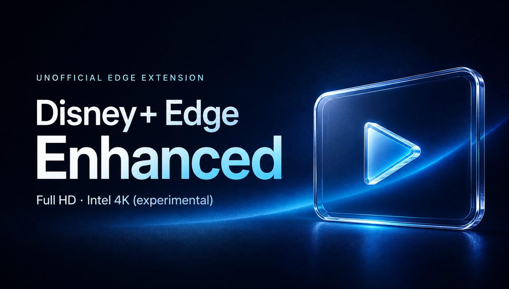

# Disney+ Edge Enhanced

Windows版Microsoft Edgeで、**ツールバーのアイコンをクリックしてDisney+のフルHD要求をON/OFF**にする拡張機能です。Intel GPU向けの4K選択とデバッグUIは右クリックメニューにまとめ、普段はページ上にUIを出しません。Manifest V3拡張とユーザースクリプトを同梱しています。

**Intel内蔵GPUを使うノートPCの通常Edgeで、4K映像を約5分14秒継続再生できました。** 実機記録は既存v0.3.16の「4K HDR10（SDKのPlayReady選択）」によるものです。v0.5.0はそのモードをIntel向けの右クリック項目から選べるようにしました。[構成・実測・制限](docs/intel-4k.md)。

通常フルHDモードには再生時間制限がありません。Intel向け4Kも30秒停止のない既存モードを使います。ただし、全GPU・全編・HDR表示品質を保証するものではありません。

> [!WARNING]
> **AMD機の4K HDR / ハードウェアPlayReady実験では、PC全体のフリーズ・ブルースクリーンが発生しました。** 同じノートのNVIDIA直結経路でも、1080p段階で出力保護エラーがありました。Intelでの成功を他GPUに一般化しません。タイマーやGPU名の判定はOS・ドライバー停止を防ぐ仕組みではありません。未保存の作業がある環境で試さず、同じ条件で停止した場合は繰り返さないでください。

[ダウンロード（実験版）](https://github.com/ioridev/disney-plus-edge-enhanced/releases) · [確認できたこと](docs/diagnostics.md) · [関連報告・修正情報](docs/related-issues.md) · [プライバシー](PRIVACY.md)

## 現状

| 項目 | 確認状況 |
| --- | --- |
| 1080p SDR | 2026-09-08、v0.3.13・Edge Betaの既存プロファイルで約70秒の実再生。最終1706フレーム、drop 0 |
| v0.4.0の通常フルHD | 75秒タイマー・SDK/再生POST/masterの1回制限を撤去。繰り返し要求と正規の鍵更新をモックで確認。長時間・作品全編の実再生は未確認 |
| v0.4.0のUI | 隔離したChromiumで通常時のUI非表示、デバッグ開閉、ページ側ON/OFF操作後の再読み込みとバッジ連携を確認。Edgeのネイティブなクリック・右クリック操作は実機未確認 |
| Intel内蔵GPU / 通常Edgeの4K | v0.3.16、3840×2160を313.738642秒維持、7,525フレーム増加・追加drop 0。3回の初期ライセンス処理も成功 |
| 同ノートのNVIDIA直結 | HW PlayReadyの1080p段階で出力保護エラー `0x8004CD22`。4K実復号は未試行。NVIDIA全般が非対応という意味ではない |
| 実ディスプレイ / HDR | 成功した内蔵画面は2560×1600、通常表示モードはSDR。4Kソースの復号成功とネイティブ4K/HDR表示は別 |
| v0.5.0 | 実再生済みの既存4Kモードへの入口とIntel参考判定を追加。新UIでの実機再検証・作品全編は未確認 |

## 関連報告・修正情報

Chromium issue 544339013（出力色深度とPlayReadyの報告）、AMD 26.9.1の公開修正一覧、Microsoft Q&AのRX 9070 XTフリーズ報告、Windows 25H2の別DRM修正を、[出典・確認範囲つきで整理しています](docs/related-issues.md)。

**本拡張でのフリーズと同一原因だと確認したものではありません。** Chromiumの原典全文・最新解決状態は未取得、AMDの修正一覧に記載がないことは未修正の証明ではありません。WindowsのBlu-ray/DVD/TV向け修正も、今回のストリーミング不具合の修正とは混同しません。

## できること・しないこと

- 明示的に選んだモードで、対象の再生要求のシナリオ・解像度上限や、対応SDKのセッション設定を限定変更します。
- 対応するHLS masterから既存のHEVC/AAC候補を1本に絞る診断を行います。音声・字幕・鍵宣言や、映像の実解像度を偽装するものではありません。
- manifest候補、動画の寸法、時間・フレーム進行、実際に接続したCDM、鍵状態の件数を分けて表示します。
- **DRM解除、鍵抽出、ライセンス偽造、動画ダウンロード、HDCP判定の偽装は行いません。** 正規のログイン・視聴権限・CDM・出力条件が必要です。サービス側が許可しない品質は保証できません。
- Disney+、Microsoft、各GPUメーカーの公式製品ではありません。映像・ロゴ・サービスSDK・CDMは配布していません。

## Edgeの設定（実験の前提）

**拡張を入れるだけでは、確認済みの比較条件は揃いません。** 以下は今回の実験条件であり、Disney+公式の4K有効化手順ではありません。変更前の値を記録してください。

1. 試すWindows版Edgeで `edge://flags` を開き、Windows用の **PlayReady DRM** を **Enabled** にします。
2. 同じEdgeの **Widevine DRM** を **Disabled** にします。別CDMへのフォールバックを比較結果と取り違えないための条件です。他の動画サイトに影響することがあるので、調査後は元の値へ戻してください。
3. Edgeの「システムとパフォーマンス」で、利用可能な場合の**グラフィックス／ハードウェアアクセラレーションをオン**にします。
4. **Edge本体を再起動**して反映します。タブの再読み込みだけでは不十分です。フリーズした実験タブは自動復元・自動再生しないでください。
5. Windowsで **HEVC Video Extensions** が利用可能か確認します。インストール済みなら買い直す必要はありません。コーデックの存在だけで保護再生の成功は保証されません。

フラグの名前・有無はEdgeの版によって異なります。見つからなければ、その版では前提を未確認として扱い、未確認のレジストリ変更などで代替しないでください。Edge Devを別に入れても、普段のEdgeの設定は引き継がれたとは限りません。

Windows HDR、出力色深度（bpc）、Hz、GPU/MUX、ドライバー、SVM/VBSは別の比較条件です。一度に変更しないでください。8 bpcにすればフリーズを回避できる、という結果は得られていません。

## インストール・更新

1. [Releases](https://github.com/ioridev/disney-plus-edge-enhanced/releases)から `disney-plus-edge-enhanced-v0.5.0.zip` をダウンロードし、保持できる場所に展開します。GitHubのソースZIPでも構いません。
2. Edgeで `edge://extensions` を開き、**開発者モード**をオンにします。
3. **展開して読み込み（Load unpacked）**から、展開先の **`extension` フォルダー**を選びます。`manifest.json` が入っているフォルダーです。
4. Edgeの拡張機能メニューから **Disney+ Edge Enhanced** をツールバーに表示／ピン留めします。
5. Disney+ページを再読み込みします。新規導入時はバッジが **OFF** で、ページ上のパネルは出ません。旧Helperの設定を引き継いで **DBG** と出た場合は、右クリックのデバッグUIで「無変更」に戻してから使ってください。

同時に旧Helper、別の画質変更拡張、ユーザースクリプト版を有効にしないでください。すでに注入済みのコードは拡張をオフにしただけでは消えないので、Disney+タブも再読み込みするか閉じます。**更新時は拡張フォルダー全体を更新**し、拡張一覧の再読み込みを押してDisney+ページも再読み込みします。v0.4.0ではツールバー用のファイルと権限が追加されているため、本体JSだけの差し替えでは更新できません。

ユーザースクリプト版は `DisneyPlus-Edge-Enhanced.user.js` です。ページ本体の実行領域への `document-start` 注入に対応する管理拡張が必要です。専用のツールバーボタンはないため、`Alt+Shift+4` でデバッグUIを開いてモードを選びます。今回の実再生記録は展開したMV3拡張によるもので、各スクリプト管理拡張との互換性は未検証です。

## 普段の操作

1. Disney+タブで拡張アイコンをクリックすると、フルHD要求を **ON** にして、そのタブだけ再読み込みします。作品の再生操作はDisney+側で行います。
2. もう一度クリックすると **OFF（無変更）** に戻して、そのタブだけ再読み込みします。拡張自身がEdgeを再起動したり、他のタブを再読み込みしたりすることはありません。
3. 調べたいときだけ、アイコンを右クリックして **「デバッグUIを表示／非表示」** を選びます。通常は再読み込みも再生モードの変更もしません。既存ページに新版本体が未注入の場合だけ、読み込みのため一度再読み込みします。

右クリック単独でページUIを開くのではなく、Edge標準の右クリックメニューに項目を追加する方式です。`Alt+Shift+4` でも開閉でき、パネルの「閉じる」で隠せます。デバッグUIの表示状態はタブのsessionStorageに保持します。

| バッジ | 意味 |
| --- | --- |
| OFF | 再生設定は無変更 |
| HD | 通常フルHD要求がON。**実際に1080pで再生できている証拠ではありません** |
| 4K | 「4K HDR10（SDKのPlayReady選択）」がON。実解像度・HDR表示の証明ではない。クリックでOFF |
| DBG | デバッグUIで選んだ別の要求・診断モード |
| ! | 操作または再生のエラー。右クリックからデバッグUIを確認 |

ON/OFFはDisney+のlocalStorageに保存し、次回開くDisney+ページでも使います。同じoriginのタブ間で共有される設定ですが、既に再生中の他タブのモードを即座に切り替えるものではありません。

通常フルHDは、既存の1920×1080・SDR・HEVC/AAC候補を1本選びます。**再生時間で停止せず、SDKセッション作成・再生要求・master再取得・正規の鍵更新を1回で打ち切りません。** 拡張自身が自動再生やエラー時の再試行を行うものではなく、認証・ライセンス・回線・サービス側の問題までは解消しません。

候補が見つからない、SDK構造が未対応、DRM/映像エラー、通信ガードの不成立などでは停止します。通常フルHDでこの停止が起きた場合は、保存設定もOFFへ戻し、次回読み込みで自動的に同じ処理を始めないようにします。OS全体がフリーズした場合は、この処理自体が実行できないことがあります。

## Intel GPUで4Kを選ぶ

1. Edgeと画面がIntel側を使う構成で、アイコンを右クリック → **「4Kを開始（Intel GPU向け・このページのみ）」** を選びます。成功したノートではG-HelperのGPUモード「標準」を使用しました。「標準」は両GPUを有効にするため、Intel専用モードと同じではありません。
2. WebGLの参考判定がIntelの場合に、そのタブを再読み込みして **「4K HDR10（SDKのPlayReady選択）」** を開始します。GPU判定は再読み込み後にも確認します。拡張が再生ボタンを押したり、Windows/MUX/HDR設定を切り替えたりすることはありません。
3. 720p/1080pから4Kへ上がることがあります。バッジではなく、デバッグUIの実寸法・時間とフレーム進行で確認してください。30秒停止や2回目の鍵要求で打ち切るモードではありません。
4. アイコンをクリックするとOFFになります。4Kは保存された常時ON設定にはせず、再読み込み・再起動後は無変更に戻ります。もう一度使うときは右クリックから選び直します。通常の左クリックによるONは引き続きフルHDです。

**メニュー項目自体は表示されますが、NVIDIA/AMD/ソフトウェア描画/判定不能の場合、その項目から4Kは開始しません。** 理由をデバッグUIに表示し、再生中の設定やタブは変更しません。更新直後に旧スクリプトが残っている場合も開始せず、拡張とDisney+タブの再読み込みが必要です。

WebGLのGPU名は、保護映像を復号するGPUや物理出力先の証明ではありません。ハイブリッド機では異なる可能性があり、Intel表示でも成功保証ではなく、逆に使える構成で判定できない場合もあります。Intel製の全世代・Arc等の全製品を検証済みとは扱いません。既存のデバッグ用4Kモードはそのまま残しており、新しいIntel判定は通常メニューからの開始に適用します。

## デバッグ・再生の確認

- `1920×1080`という宣言だけでなく、動画の実寸法・時間とフレーム数の増加を確認します。`edge://media-internals`でも接続CDM・解像度・codecを確認できます。
- 「環境チェック」のEME API受付はCDMの実使用を示しません。「接続CDM / 鍵」と実フレームを確認します。
- 「診断をコピー」は手動操作時だけクリップボードへ書き込みます。
- 旧 **「1080p SDR・HEVC/AACを1候補に固定（75秒比較）」** は短時間診断用として残しています。こちらはSDK開始から75秒で予定停止し、次の再読み込みで自動再開しません。普段の視聴では「フルHD（1080p SDR・時間制限なし）」を使います。
- 4K HDR単一候補の30秒制限など、危険な比較モードの制限は変更していません。

時間制限の撤去と実機での安定性は別です。Intelでの5分試験は初期の複数ライセンス処理を含みますが、後の時間経過による鍵切替、作品全編、シーク・吹替変更、別作品やGPUでの継続再生は引き続き検証が必要です。

## 開発・テスト

Node.js 24以上を使います。拡張を利用するだけならNode.jsは不要です。npm依存パッケージのインストールも不要です。

```sh
npm test
npm run build
npm run build:check
```

`extension/DisneyPlus-Edge-Enhanced.user.js`が配布する本体です。`src/`のHLS選択・通信アダプターを編集した場合は `npm run build` で本体の埋め込み部分を更新します。それ以外の本体は同ファイルを直接編集します。

テストはNode VM上のfetch/XHR・SDK・EMEモックで実行し、実ネットワーク呼出しを検出するガードを読み込みます。ブラウザー・アカウント・本物のCDMは使いません。オフラインテストの成功を、実機での画質・安定性の証拠にはしません。

Windowsで配布ZIPを作る場合:

```powershell
powershell -NoProfile -File scripts/package.ps1
```

テスト後、明示したファイルだけを `dist/` に出力します。同じ版のZIPが既にある場合は上書きせず停止します。

## 報告・ライセンス

不具合報告には、Windows/Edge/GPU/ドライバーの版、選んだモード、前提設定、実寸法とフレーム進行、エラーの有無を添えてください。**HAR、Cookie、認証ヘッダー、完全なmanifestやライセンス応答、メモリダンプを公開Issueに貼らないでください。** コピーした診断も投稿前に確認してください。

[MIT License](LICENSE)。参考資料と第三者の権利については[NOTICE](NOTICE.md)を参照してください。

## English summary

Windows Edge extension with a one-click full-HD request toggle. Right-click its toolbar icon and choose the debug UI item for diagnostics; the page overlay is hidden by default. v0.4.0 adds a normal full-HD mode without the old 75-second duration or one-SDK/POST/master limits. The HD badge indicates the requested mode, not verified picture quality. Native errors still stop the mode and reset the saved preference to OFF.

**4K video playback was observed for 313.74 seconds on an Intel Iris Xe laptop using regular Edge and the existing v0.3.16 HDR10 SDK PlayReady mode:** 7,525 additional frames, zero additional drops, and three successful initial license updates. The same laptop's NVIDIA-direct configuration failed with an output-protection error at 1080p; actual 4K decoding was not attempted there. This does not establish a vendor-wide defect. The internal display was 2560×1600 in SDR mode, so this proves 4K source decoding, not native 4K output or HDR fidelity. [Recorded evidence](docs/intel-4k.md).

v0.5.0 adds a right-click **Intel 4K** entry for that existing mode, with no 30-second playback cap. It checks a WebGL GPU-vendor hint at selection and after reload, refuses non-Intel/unknown results, and remains opt-in for one page. WebGL cannot certify the protected-video/output route. New UI hardware validation, later timed key rotation and full-title playback remain unverified. The separate diagnostic modes retain their 75-second FHD and 30-second HDR limits.

**Hardware PlayReady / 4K HDR tests have frozen the entire PC or caused a BSOD. Software timers cannot prevent OS/GPU hangs.** This is not a DRM bypass, key extractor, or downloader. Keep legitimate subscription and playback permissions. Prerequisites used in the comparison were PlayReady enabled, Widevine disabled, hardware acceleration enabled, HEVC available, and a full Edge restart; restore changed flags afterward. Load the entire `extension` directory unpacked, pin its icon, and start in OFF. MIT licensed; no affiliation with Disney or Microsoft.
